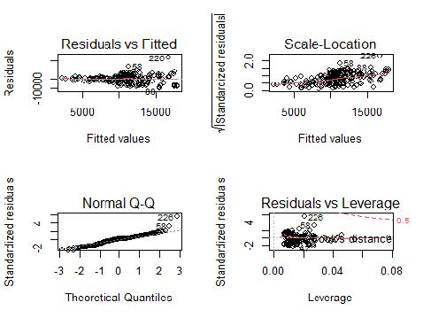
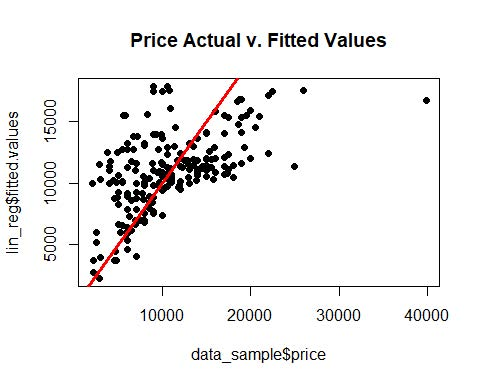
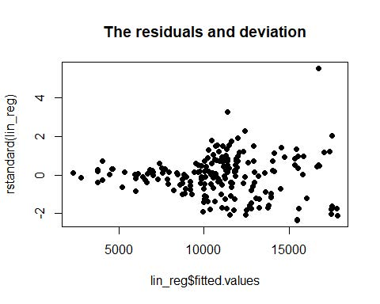
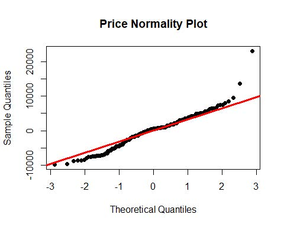
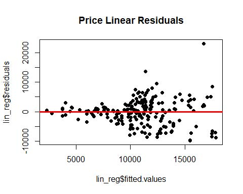
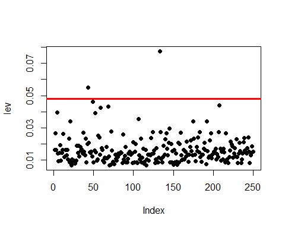

# Multiple Regression Vehicle Price Prediction

## Problem Statement
Create a primary data set for the analysis of n=250 randomly selected cars. Use the random number seed. The characteristics of this primary data set will be:
1. Only vehicles with MAKE of “cadillac”.
2. Only cars from the 2006 through 2011 model years (inclusive).
3. Only cars with engines of 6 or 8 cylinders.

Build a Multiple Linear Regression Model in R and answer the following questions.
Analysis

## Dataset
Dataset: This information is on 45,425 automobiles offered for sale on Craig's List in the United States. The variables in the data set are:
1. REGION: The region (defined by Craig's List) where the car was for sale.
2. PRICE: The asking price given in the ad for the car.
3. YEAR: The model year of the auto for sale.
4. MAKE: The manufacturer of the car.
5. MODEL: The particular model of the car.
6. CONDITION: The seller-defined condition of the car.
7. CYLINDERS: The number of cylinders of the car's engine.
8. FUEL: The fuel type the car uses, gasoline or diesel.
9. ODOMETER: The odometer reading (miles) on the car.
10. PAINT COLOR: The color of the car.

Dataset can be found here: [Price Data](Data/)

## Business Questions
1. Conduct a multiple linear regression on your random sample with PRICE as the dependent variable and ODOMETER, YEAR, and CYLINDERS as the independent variables.
2. Report the beta coefficients and associated p values and beta coefficient confidence intervals from the model.
3. Conduct appropriate analyses and give interpretations to determine if your model is a good fit to the data in the primary data set.
4. Assess the model’s conformance with the LINE assumptions of regression.
5. Throckmorton P. Gildersleeve of Summerfield, Tennessee would like to sell his 2011 Cadillac DT. He says the vehicle is in "excellent" condition and has 175,757 miles on the odometer. Mr. Gildersleeve has not shared details of his Cadillac’s engine because he thinks that all 2011 DTS cars had the same famous engine. Determine what price he should ask for the car. Do you believe your pricing advice to the Great Gildersleeve is accurate and usable? Give reasoning for the conclusions.

## Analysis
**Ask-1,2,3** 
From the data in the “Cylinders” column, we can say that it is a factor variable and R treats it as such.

By default, R treats the “Year” column as character. So, I have converted the column into numeric (If not done, it would treat each year as a factor variable).

From the Multiple Regression analysis:
- The estimated B0 – Coefficients for the values are small.
- For all the variables, the p-value is < 0.05. This states we can reject the null hypothesis and accept the alternate, so we can say the B – Coefficients are not zero and have a value.
- The Regression Equation is y [Price] = – 0.000002681 – 0.02356 + 0.00134*Year + 0.00566*Cylinders.
- The R-sq is 0.3392, that means all the X variables explains about 33.92% of variation in Y. Based on this, we can say the model is not a good measure of price based on the variables we have taken for our analysis.
- If Year and Cylinders is zero then price decreases, which is something we cannot interpret.
- But we can say there is a direct proportionality between (year, price) and (cylinders, price).

**Ask-4** 

Based on our analysis, we can say our model is not a good fit for our data. • We also see heteroscedasticity from the residual plots.

**Linearity** 

Data follows linearity but there is an outlier at price = 40,000, pulling the regression line towards itself.

**Independence** 

The fitted vales with their residuals show no pattern and is random. So, it qualifies the Independence test.

**Normality** 

From the plot the data almost follows a normal distribution but there are few values out in the tails.

**Equality of Variances** 

There is a bit of a scattering across the plot. But, we do not have any pattern. So, it satisfies the equality of variance.

**Identifying high leverage points** 

**Ask-5** 

The price prediction is 15227.22, but we cannot say that our prediction is accurate. Even though there seems to be a linear relationship and the data follows heteroscedasticity, due the low R-Sq and a wide range on the CI.

## Conclusion
I enjoyed working on this project about multiple regression where we are using a advanced dataset with multiple independent variables which helped me understand how to interpret results of my analysis and put them into simple and consice wording that can be quantitatively understood by a business executive. I applied the usual steps like exploratory data analysis (EDA), checking correlations, regression analysis, plotting, analysing high leverage points which gives a new perspective on which of the data points carry the most impact and building an ML model to solve a business problem.

